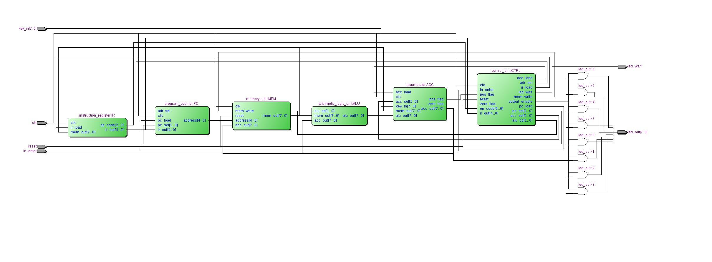
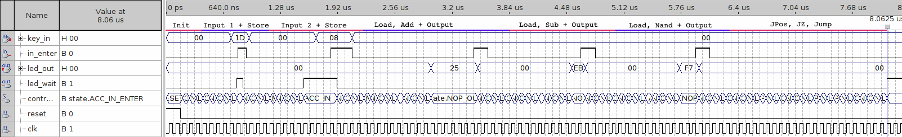
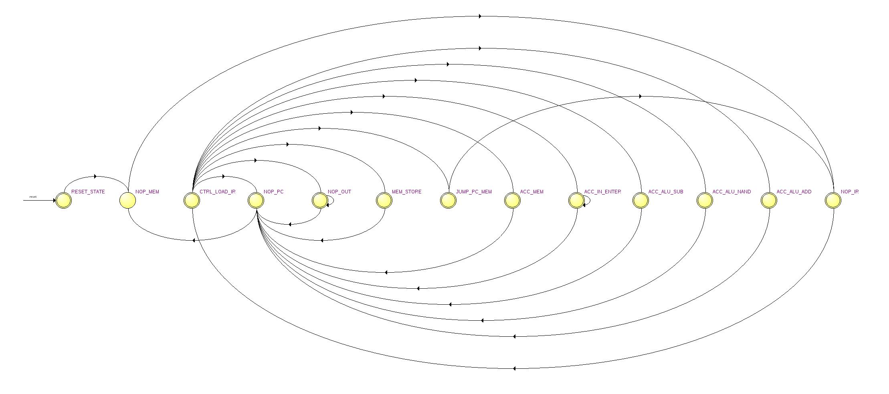

8 Bit CPU
=========

A simple 8 Bit CPU-Design written in VHDL.

I wrote this code for a computer architecture course at my university.

---

## CPU Architecture

RTL-Diagram of the CPU-Entity:



## Instruction Set

The CPU can perform 10 different instructions. Each instruction contains 3 operation code bits and 5 data bits.

The IN and OUT instructions don't need an address. All other instructions doing their work with the data behind the given memory address and the value stored in the accumulator.

|Instruction|Op-Code|Data|Function|Clock Cycles|
|---|---|---|---|---|
|LOAD   |000|aaaaa|ACC <- MEM(aaaaa)|5|
|STORE  |001|aaaaa|MEM(aaaaa) <- ACC|5|
|ADD    |010|aaaaa|ACC <- ACC + MEM(aaaaa)|5|
|SUB    |011|aaaaa|ACC <- ACC + MEM(aaaaa)|5|
|NAND   |100|bbbbb|ACC <- not(ACC and MEM(aaaaa))|5|
|IN     |100|00000|ACC <- Input|5|
|OUT    |100|00001|Output <- Acc|5|
|JZ     |101|aaaaa|PC <- aaaaa if ACC = 0|4|
|JPOS   |110|aaaaa|PC <- aaaaa if ACC > 0|4|
|J      |111|aaaaa|PC <- aaaaa|4|

```
aaaaa => Address
bbbbb => Address > 0x01

ACC => Accumulator
MEM => Memory
PC  => Program Counter
```

When starting the CPU or after pressing Reset. It needs a 3 Cycle init-process to load the first instruction.

The IN instruction waits until the `in_enter` signal is active. During this time the `led_wait` is active to show you that the CPU needs some input.
Also the OUT instruction wait for the `ìn_enter` signal to go on. This
behaviour is made, bacause of the output would disappear to fast with
the next clock-cycle.

## Default Program Simulation

The default program loads every time when reset was active. When you start the CPU (Simulation or on a device), you must first set reset active to initialize the program.

The default program is for testing all instructions:

Assembler like Code with the instruction names from the table:
```
0x00 LOAD    0x19    ; Load value of mem-address 25 to acc
0x01 IN              ; Get Input to Acc
0x02 STORE   0x18    ; Store acc to mem-address 24
0x03 IN              ; Get input to Acc
0x04 STORE   0x17    ; Store acc to mem-address 23
0x05 ADD     0x18    ; Add Input 1 to Input 2
0x06 OUT             ; Show result
0x07 LOAD    0x18    ; Load Input 1
0x08 SUB     0x17    ; Sub Input 2 from Input 1
0x09 OUT             ; Show result
0x0A LOAD    0x18    ; Load Input 1
0x0B NAND    0x17    ; Nand input 1 with Input 2
0x0C OUT             ; Show result
0x0D LOAD    0x1F    ; Load value 0x06 into Acc
0x0E JPOS    0x12    ; JPos to 0x12
0x0F OUT             ; Never called
0x10 J       0x00    ; Jump to program start
0x11                 ; Never called
0x12 LOAD    0x19    ; Load value 0x00 to Acc
0x13 JZ      0x10    ; JZ to 0x10

```

Program in the VHDL-Memory_Unit (including values):

```
-- Some Values
ram(31) <= "00000110";      -- Value: 0x06
ram(30) <= "00000101";      -- Value: 0x05
ram(29) <= "00000100";      -- Value: 0x04
ram(28) <= "00000011";      -- Value: 0x03
ram(27) <= "00000010";      -- Value: 0x02
ram(26) <= "00000001";      -- Value: 0x01
ram(25) <= "00000000";      -- Value: 0x00

-- Default Program
--
--          Ins  |  Addr
ram(00) <= "000" & "11001"; -- ACC <- 0x00
ram(01) <= "100" & "00000"; -- ACC <- IN
ram(02) <= "001" & "11000"; -- MEM(24) <- ACC
ram(03) <= "100" & "00000"; -- ACC <- IN
ram(04) <= "001" & "10111"; -- MEM(23) <- ACC
-- ADD
ram(05) <= "010" & "11000"; -- ACC <- ACC + MEM(24)
ram(06) <= "100" & "00001"; -- OUT <- ACC
-- SUB
ram(07) <= "000" & "11000"; -- ACC <- MEM(24)
ram(08) <= "011" & "10111"; -- ACC <- ACC - MEM(23)
ram(09) <= "100" & "00001"; -- OUT <- ACC
-- NAND
ram(10) <= "000" & "11000"; -- ACC <- MEM(24)
ram(11) <= "100" & "10111"; -- ACC <- ACC nand MEM(23)
ram(12) <= "100" & "00001"; -- OUT <- ACC
-- JPos
ram(13) <= "000" & "11111"; -- ACC <- MEM(31)
ram(14) <= "110" & "10010"; -- PC <- 18
-- JZ
ram(18) <= "000" & "11001"; -- ACC <- MEM(25)
ram(19) <= "101" & "10000"; -- PC <- 16
-- Jump
ram(15) <= "100" & "00001"; -- OUT <- ACC
ram(16) <= "111" & "00000"; -- PC <- 00
```

### Simulation

Logicsimulation of the program above:



## Control Unit: State Machine



